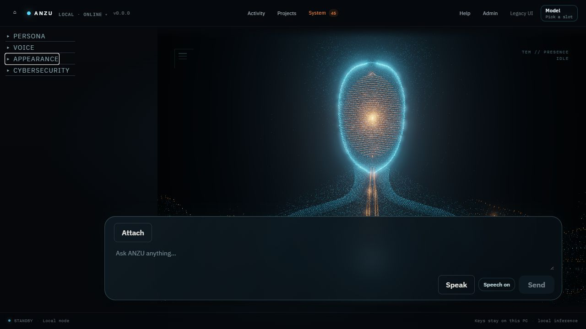
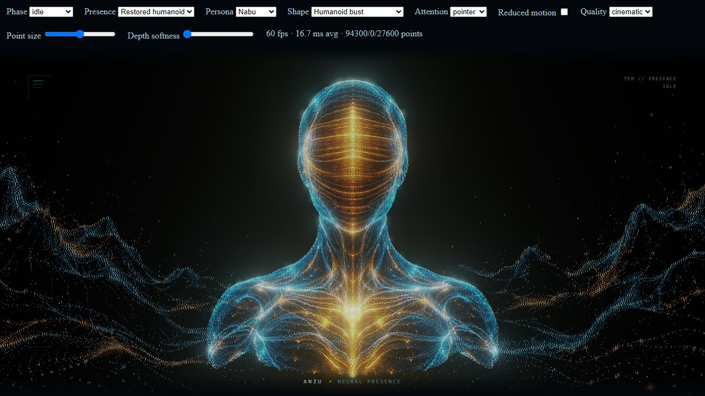
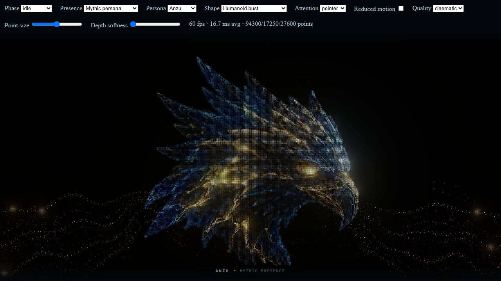
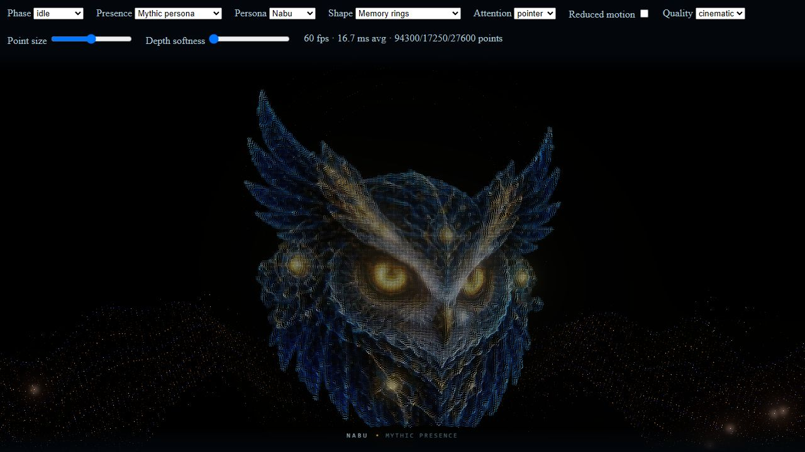
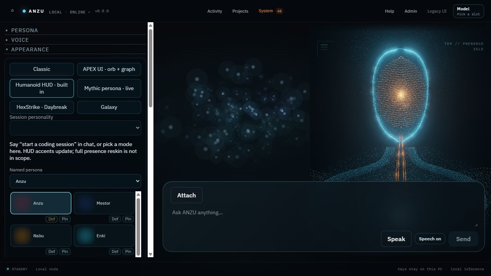
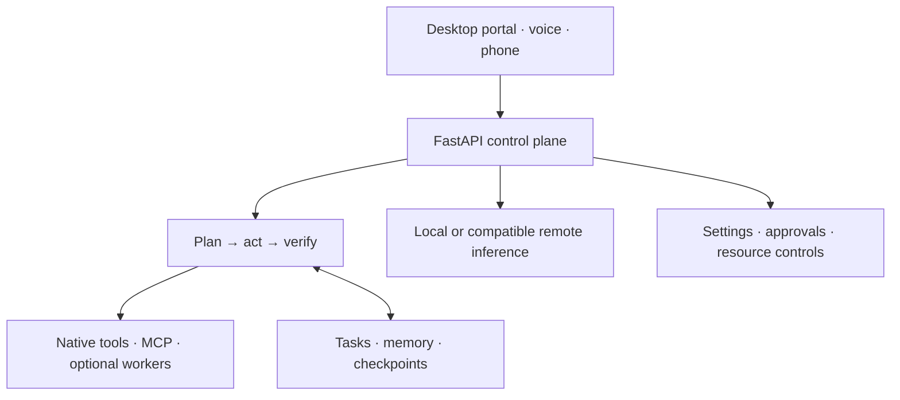

<div align="center">

# ANZU Superassistant

### A personal AI that turns intent into finished work.

**Local intelligence. Capable agents. A desktop experience with presence.**

A self-hosted assistant for research, coding, writing, automation, and everyday work — built around your hardware and your control.

[Getting started](#getting-started) · [Features](#what-anzu-does) · [Architecture](#how-it-works) · [Documentation](#documentation) · [Contributing](#development--contributing)

   

</div>

---

## Meet ANZU

ANZU brings local language models, tool execution, task management, and an approachable control interface together in one self-hosted system. Run inference on your own machine, connect an OpenAI-compatible inference server when needed, and build workflows around the tools you actually use.

**ANZU Superassistant is the product name; Jarvis remains the repository and technical identifier in existing scripts, paths, and installer names.**

A public clone can start as a **household voice chatbot** (Kokoro) without a 9B/27B GGUF. Add a local model, run `bootstrap.ps1 -InstallLocalLLM`, or point at any OpenAI-compatible server when you want full agent work. The default local LLM when present is **Qwen3.5-9B Abliterated**; **Qwen3.5-27B** is Expert escalation.

### The experience we are building

Tell ANZU what you want accomplished. It should plan the work, use the right tools, recover when something fails, verify the result, and report clearly. You should not need to manage models, workers, or individual tool calls for every task.

The goal is a polished, luxurious assistant: a calm workspace, clear progress, thoughtful typography, responsive voice, and a distinctive animated presence. Appearance and reliability are part of the same product standard. A beautiful interface must make useful work easier to understand and control.

**Development snapshot · October 2026:** the repository contains the desktop portal, native tools, persistent tasks and memory, persona bindings, agent-room infrastructure, and phone integrations. Availability depends on installed models, packages, and device setup. Multi-device autonomy and the broader specialist ecosystem remain under development; code presence does not establish a verified end-to-end release.

## Interface

| Owner HUD | Particle humanoid |
| :---: | :---: |
|  |  |

| Anzu — storm bird | Nabu — owl of knowledge |
| :---: | :---: |
|  |  |



The presence is a live WebGL dot cloud: it forms, breathes, reacts to assistant state, and morphs between the humanoid and each persona-specific mythical avatar.

## What ANZU does

| Capability | Description |
| :--- | :--- |
| **Local-first AI** | Run GGUF models with llama.cpp, switch model profiles, or use a compatible remote inference endpoint. |
| **Owner HUD** | Chat, voice, appearance, cybersecurity controls, and expandable local health on the desktop portal. |
| **This PC** | Files, terminal, Python, git, Playwright, Windows UI Automation, Office COM, and screenshots. |
| **Memory** | SQLite tasks, Obsidian-linked vault, skills, trajectories, and context repos. |
| **Phone companion** | Android APK with LAN pairing; WAN/4G failover when prepared. |
| **Windows installer** | `JarvisSetup.exe` plus Start/Stop scripts; owner license is issued beside Setup, not inside the payload. |
| **Extensible tools** | Native tools and MCP integrations; see the tool catalog for available integrations and requirements. |
| **Configurable access** | Keep the service on localhost by default or explicitly enable authenticated LAN access. |

### Recent development foundations

| Area | What is in the repository | Specification |
| :--- | :--- | :--- |
| **Personas and presence** | Named specialist catalog, WebGL shape bindings, appearance settings, and neural voice profiles | [RFC-0137](docs/rfcs/0137-persona-presence-shape-and-voice-binding.md) |
| **Agent collaboration** | Agent-room supervisor, shared blackboard, history, audit, and resource governor | [RFC-0174](docs/rfcs/0174-multi-agent-rooms-blackboard-deadlock-and-handoff.md) |
| **Local-model reliability** | Model/tool compatibility work and evaluation infrastructure | [RFC-0180](docs/rfcs/0180-local-model-agentic-reliability.md) |
| **Long-running work** | Persistent task context and work toward bounded processing of large inputs | [RFC-0182](docs/rfcs/0182-context-and-segmented-agentic-tasks.md) |
| **Local management** | Separate manager service and local control interface | [RFC-0196](docs/rfcs/0196-native-anzu-manager.md) |

These are implementation foundations, with live Windows, model, voice, and device validation still required for their respective workflows.

<details>
<summary><strong>Meet the specialist personas</strong></summary>

| Persona | Focus |
| :--- | :--- |
| **Anzu** | Main assistant and orchestration |
| **Mestor** | Planning and operations |
| **Nabu** | Memory and research |
| **Enki** | Coding and engineering |
| **Veles / Themis** | Threat analysis / defensive security |
| **Aegir / Bragi** | Media / writing |
| **Hermes** | Browser, messaging, and APIs |
| **Heimdall / Eir** | Monitoring / household routines |
| **Maia / Vulcan** | Audience growth / hardware and infrastructure |

Personas bind presentation, voice, and specialist intent. Their names do not imply that every planned domain workflow is complete.

</details>

## Getting started

**Target platform:** Windows 11. The repository's startup scripts and some desktop integrations are Windows-specific. A GPU-capable NVIDIA setup is used for the documented local inference configuration.

For a new machine, start with the **[complete installation guide](docs/INSTALL.md)**. A Windows installer is also under development; see [installer status](INSTALLER.md) before assuming one-click setup is complete.

If you have **already cloned the repository**, you can start without a GGUF as a voice chatbot (`.\start-jarvis.ps1`). For full local inference, install model weights and llama.cpp (see [INSTALL.md](docs/INSTALL.md)), then:

```powershell
python -m pip install -r backend\requirements.txt
python -m playwright install chromium
cd frontend
npm install
npm run build
cd ..
.\start-jarvis.ps1
```

Open **http://127.0.0.1:4780** if the portal does not open automatically.

To stop ANZU:

```powershell
.\stop-jarvis.ps1
```

> **Important:** Model weights, llama.cpp binaries, and local runtime data are not included in Git. Follow [INSTALL.md](docs/INSTALL.md) for prerequisites, downloads, and initial configuration. Do not expose the portal or API to the public internet without reviewing [SECURITY.md](SECURITY.md).

### Everyday workflows

Start ANZU with a task and wait for completion:

```powershell
.\start-jarvis.ps1 -Prompt "Inspect directory and generate project report" -Wait
```

Or submit a task file:

```powershell
.\start-jarvis.ps1 -PromptFile .\tasks\sample_task.json -Wait
```

The portal also includes **Guide & Workflows** for operating instructions and task templates. For advanced startup flags, LAN authentication, and model configuration, use the [installation guide](docs/INSTALL.md).

## How it works



The current application combines a **FastAPI backend** with a **React control portal**. Local inference uses **llama.cpp**; an OpenAI-compatible server can be configured as an alternative. A REST API provides the interface for clients and integrations. See [ARCHITECTURE.md](ARCHITECTURE.md) and [docs/DEVELOPMENT.md](docs/DEVELOPMENT.md) for implementation details.

The planned swarm architecture separates orchestration, leadership, and worker responsibilities, with configurable placement and host-resource limits. Its design is documented in [SWARM_ARCHITECTURE.md](SWARM_ARCHITECTURE.md); do not treat that document as a description of fully shipped functionality.

## Models and hardware

The documented reference installation uses **Windows 11 Pro, an Intel Core i7-14700KF, 64 GB RAM, and an NVIDIA RTX 5070 Ti with 16 GB VRAM**. This is the development configuration, **not a universal minimum system requirement**.

- **Everyday inference:** Qwen3.5-9B Abliterated via llama.cpp; a locally available Qwen3.8-9B uncensored GGUF is preferred by the current autoload logic when found.
- **Expert escalation:** Qwen3.5-27B, with fitting/offloading as needed.
- **Other backends:** a configurable OpenAI-compatible inference server.

The portal exposes **Fast / Balanced / Quality** model profiles. Agent execution modes are separate from model profiles. See [INSTALL.md](docs/INSTALL.md) for exact model paths and setup, and [TROUBLESHOOTING.md](TROUBLESHOOTING.md) for CUDA or model-loading issues.

## Where ANZU is heading

| Area | Direction | Reference |
| :--- | :--- | :--- |
| **Multi-device intelligence** | Orchestrator, leader, senior/junior workers, node roles, and resource controls | [Swarm architecture](SWARM_ARCHITECTURE.md) |
| **Autonomous operations** | Away Mode, delegated workflows, publishing, research, and marketing | [Jarvis 2.0](JARVIS_2.0.md) |
| **Specialized intelligence** | Adaptive domain packs and specialized workers | [Adaptive domain architecture](ADAPTIVE_DOMAIN_ARCHITECTURE.md) |
| **Security** | Defensive monitoring and gated security-agent design | [Security agents](SECURITY_AGENTS.md) |
| **Additional interfaces** | Windows desktop shell, phone companion, voice, and home integration | [Windows shell](WINDOWS_SHELL.md) · [Android client](ANDROID_CLIENT.md) · [Home IoT](HOME_IOT.md) |

The master plan sets priorities; newer RFCs and the code provide detail on later implementation. Read their status and acceptance criteria together rather than treating a design document as proof of a shipped feature.

## Documentation

| Start here | What you will find |
| :--- | :--- |
| [Installation](docs/INSTALL.md) | Prerequisites, models, Windows setup, startup, and authentication |
| [Development guide](docs/DEVELOPMENT.md) | Repository map, local development, APIs, tools, and tests |
| [Architecture](ARCHITECTURE.md) | Control plane, memory, compaction, and autonomy |
| [Tools](TOOLS.md) | Native integrations, MCP, skills, and trajectories |
| [Security](SECURITY.md) | Network binding, keys, and filesystem policy |
| [Troubleshooting](TROUBLESHOOTING.md) | Common model, CUDA, browser, Office, and Docker issues |
| [Task status and approvals](docs/TASK_STATUS_AND_APPROVALS.md) | Approval gates, task phases, and progress feedback |
| [Development process](docs/PROCESS.md) | RFCs, branches, review, and release workflow |
| [RFC index](docs/rfcs/) | Proposals and detailed technical specifications |

For the wider roadmap, see [Jarvis master plan](JARVIS_MASTER_PLAN.md) and [Jarvis 2.0](JARVIS_2.0.md).

## Development & contributing

ANZU Superassistant is under active development. Start with [docs/DEVELOPMENT.md](docs/DEVELOPMENT.md), then read the [development process](docs/PROCESS.md) and relevant [RFCs](docs/rfcs/) before making architectural changes.

- **`main`** is the stable release branch; development work branches from **`development`** and targets it with pull requests.
- Keep changes scoped to one RFC or development-queue item per worker.
- Consult [JARVIS_MASTER_PLAN.md](JARVIS_MASTER_PLAN.md) for the current priorities and development queue.

Run unit tests without a GPU:

```powershell
python -m pytest tests -q
```

For the live desktop end-to-end suite, start Jarvis with a model loaded, then run:

```powershell
python tests\run_e2e.py
```

Test commands are provided for contributors; this README does not assert that every test currently passes.

---

<div align="center">

**ANZU Superassistant — your intent, carried through.**

[Explore the documentation](docs/INSTALL.md) · [View the roadmap](JARVIS_MASTER_PLAN.md) · [Browse the code](https://github.com/Daan298261/Jarvis)

</div>
